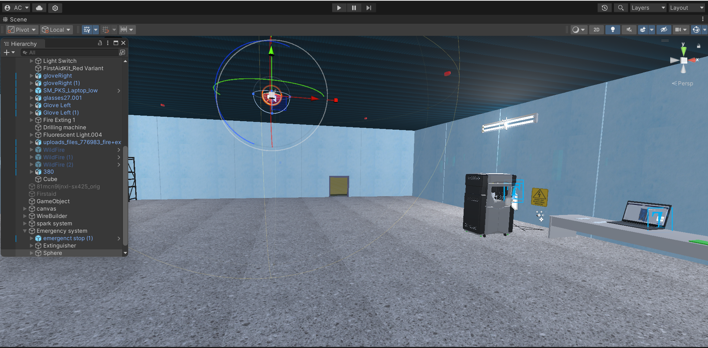

# VR Safety Training for 3D Printer Operation

## Overview

This project is an immersive **Virtual Reality (VR) safety training module** designed to simulate operational hazards and safe working procedures for industrial **3D printer systems**.

The simulation allows users to interact with a virtual training environment where they can learn correct safety protocols, identify hazards, and practice proper machine handling without real-world risks.

The goal of this project is to **improve safety awareness and operational understanding in additive manufacturing environments** through interactive VR training.

---

## Features

- Immersive **VR training environment**
- Interactive **hazard awareness simulation**
- Realistic **3D printer workstation**
- Safety equipment interaction (extinguisher, emergency stop, etc.)
- High-fidelity **3D models optimized for VR performance**
- Training scenarios demonstrating **safe machine operation**

---

## Screenshot



*Unity scene showing the VR safety training environment with the 3D printer workstation, hazard indicators, and interactive safety equipment.*

---

## Technologies Used

- **Unity Engine**
- **C#**
- **SolidWorks** – Industrial CAD modeling
- **Blender** – 3D model optimization and asset preparation
- **Virtual Reality Development Tools**

---

## Project Structure

```
VR-Safety-Training-for-3D-Printer-Operation
│
├── Assets/              # Unity assets (scripts, scenes, models, materials)
├── Packages/            # Unity package dependencies
├── ProjectSettings/     # Unity project configuration
│
├── docs/
│   └── images/
│       └── vr_training_environment.png
│
├── .gitignore
├── LICENSE
└── README.md
```

---

## How to Run the Project

1. Install **Unity Hub**
2. Install the **Unity Editor version compatible with this project**
3. Clone this repository

```bash
git clone https://github.com/yourusername/VR-Safety-Training-for-3D-Printer-Operation.git
```

4. Open **Unity Hub**
5. Click **Add Project**
6. Select the cloned project folder
7. Open the project in Unity
8. Load the main training scene and run the simulation

Unity will automatically import assets and generate the required internal files when the project is opened.

---

## Dependencies

Some folders required for Unity projects are **not included in the repository** because they are automatically generated by Unity or are specific to the developer's machine. These folders are excluded using `.gitignore` to keep the repository lightweight.

### Unity Generated Folders (Auto-created)

The following folders are ignored but will be **automatically generated when the project is opened in Unity**:

```
Library/
Temp/
Logs/
Obj/
Build/
UserSettings/
```

These folders contain:

- Cached imported assets
- Compiled scripts
- Temporary build data
- Local editor settings

They **do not need to be manually downloaded**. Unity recreates them automatically when the project is opened.

---

## Required Software

To run this project, the following tools are required:

- **Unity Hub**
- **Unity Editor**
- **Visual Studio or VS Code** (for C# development)

---

## Project Objectives

- Improve **hazard awareness in additive manufacturing environments**
- Provide **interactive VR training for safe machine operation**
- Simulate real-world safety scenarios without physical risk
- Enhance learning through **immersive simulation**

---

## Author

**Aditya Chaturvedi**

---

## Notes

If the project is opened for the first time, Unity may take several minutes to:

- Import assets
- Rebuild the Library folder
- Compile scripts

This is expected behavior for Unity projects.

---
